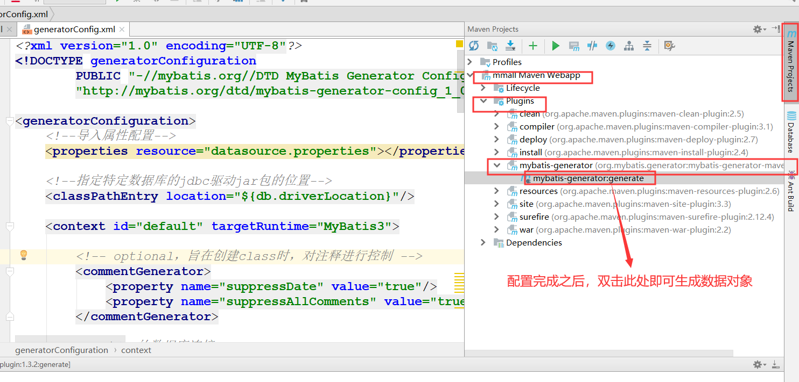

# Mybatis三剑客

## Mybatis-Generator的使用
    1. mybatis-generator的配置如下所示
        * 注意：配置文件名为generatorConfig.xml
    
```xml
<?xml version="1.0" encoding="UTF-8"?>
<!DOCTYPE generatorConfiguration
        PUBLIC "-//mybatis.org//DTD MyBatis Generator Configuration 1.0//EN"
        "http://mybatis.org/dtd/mybatis-generator-config_1_0.dtd">

<generatorConfiguration>
    <!--导入属性配置-->
    <properties resource="datasource.properties"></properties>

    <!--指定特定数据库的jdbc驱动jar包的位置-->
    <classPathEntry location="${db.driverLocation}"/>

    <context id="default" targetRuntime="MyBatis3">

        <!-- optional，旨在创建class时，对注释进行控制 -->
        <commentGenerator>
            <property name="suppressDate" value="true"/>
            <property name="suppressAllComments" value="true"/>
        </commentGenerator>

        <!--jdbc的数据库连接 -->
        <jdbcConnection
                driverClass="${db.driverClassName}"
                connectionURL="${db.url}"
                userId="${db.username}"
                password="${db.password}">
        </jdbcConnection>


        <!-- 非必需，类型处理器，在数据库类型和java类型之间的转换控制-->
        <javaTypeResolver>
            <property name="forceBigDecimals" value="false"/>
        </javaTypeResolver>


        <!-- Model模型生成器,用来生成含有主键key的类，记录类 以及查询Example类
            targetPackage     指定生成的model生成所在的包名
            targetProject     指定在该项目下所在的路径
        -->
        <!--<javaModelGenerator targetPackage="com.arbonkeep.pojo" targetProject=".\src\main\java">-->
        <javaModelGenerator targetPackage="com.mmall.pojo" targetProject="./src/main/java">
            <!-- 是否允许子包，即targetPackage.schemaName.tableName -->
            <property name="enableSubPackages" value="false"/>
            <!-- 是否对model添加 构造函数 -->
            <property name="constructorBased" value="true"/>
            <!-- 是否对类CHAR类型的列的数据进行trim操作 -->
            <property name="trimStrings" value="true"/>
            <!-- 建立的Model对象是否 不可改变  即生成的Model对象不会有 setter方法，只有构造方法 -->
            <property name="immutable" value="false"/>
        </javaModelGenerator>

        <!--mapper映射文件生成所在的目录 为每一个数据库的表生成对应的SqlMap文件 -->
        <!--<sqlMapGenerator targetPackage="mappers" targetProject=".\src\main\resources">-->
        <sqlMapGenerator targetPackage="mappers" targetProject="./src/main/resources">
            <property name="enableSubPackages" value="false"/>
        </sqlMapGenerator>

        <!-- 客户端代码，生成易于使用的针对Model对象和XML配置文件 的代码
                type="ANNOTATEDMAPPER",生成Java Model 和基于注解的Mapper对象
                type="MIXEDMAPPER",生成基于注解的Java Model 和相应的Mapper对象
                type="XMLMAPPER",生成SQLMap XML文件和独立的Mapper接口
        -->

        <!-- targetPackage：mapper接口dao生成的位置 -->
        <!--<javaClientGenerator type="XMLMAPPER" targetPackage="com.arbonkeep.dao" targetProject=".\src\main\java">-->
        <javaClientGenerator type="XMLMAPPER" targetPackage="com.arbonkeep.dao" targetProject="./src/main/java">
            <!-- enableSubPackages:是否让schema作为包的后缀 -->
            <property name="enableSubPackages" value="false" />
        </javaClientGenerator>


        <table tableName="mmall_shipping" domainObjectName="Shipping" enableCountByExample="false" enableUpdateByExample="false" enableDeleteByExample="false" enableSelectByExample="false" selectByExam="false" selectByExampleQueryId="false"></table>
        <table tableName="mmall_cart_item" domainObjectName="CartItem" enableCountByExample="false" enableUpdateByExample="false" enableDeleteByExample="false" enableSelectByExample="false" selectByExampleQueryId="false"></table>
        <table tableName="mmall_category" domainObjectName="Category" enableCountByExample="false" enableUpdateByExample="false" enableDeleteByExample="false" enableSelectByExample="false" selectByExampleQueryId="false"></table>
        <table tableName="mmall_order" domainObjectName="Order" enableCountByExample="false" enableUpdateByExample="false" enableDeleteByExample="false" enableSelectByExample="false" selectByExampleQueryId="false"></table>
        <table tableName="mmall_order_item" domainObjectName="OrderItem" enableCountByExample="false" enableUpdateByExample="false" enableDeleteByExample="false" enableSelectByExample="false" selectByExampleQueryId="false"></table>
        <table tableName="mmall_pay_info" domainObjectName="PayInfo" enableCountByExample="false" enableUpdateByExample="false" enableDeleteByExample="false" enableSelectByExample="false" selectByExampleQueryId="false"></table>
        <table tableName="mmall_product" domainObjectName="Product" enableCountByExample="false" enableUpdateByExample="false" enableDeleteByExample="false" enableSelectByExample="false" selectByExampleQueryId="false">
            <columnOverride column="detail" jdbcType="VARCHAR" />
            <columnOverride column="sub_images" jdbcType="VARCHAR" />
        </table>
        <table tableName="mmall_user" domainObjectName="User" enableCountByExample="false" enableUpdateByExample="false" enableDeleteByExample="false" enableSelectByExample="false" selectByExampleQueryId="false"></table>


        <!-- geelynote mybatis插件的搭建 -->
    </context>
</generatorConfiguration>

```

    2. mybatis-generator生成数据对象和时间戳优化
        <1> 在maven中选择如下内容，即可生成所需对象

  

        <2> 时间戳的优化
            1) 由于我们每个表都有creat_time,和update_time,我们不再代码中控制它们，而是提交给db控制，所以需要将
               对应的进行修改
            
                * 只需要在xml配置文件中将对应字段的value修改成now()即可，insert相关语句只需要两个都修改为null，
                  update语句只需要修改update_time

            
## Mybatis-plugin的使用
    1. mybatis-plugin插件的作用
        <1> 有利于查看对应代码，可以在代码与配置之间实现跳转

    2. 直接在idea中的plugin安装该插件即可


## Mybatis--PageHelper(分页工具)的使用
    1. 在pom.xml导入相关依赖即可

```xml
<dependency>
    <groupId>com.github.pagehelper</groupId>
    <artifactId>pagehelper</artifactId>
    <version>4.1.0</version>
</dependency>

<dependency>
    <groupId>com.github.miemiedev</groupId>
    <artifactId>mybatis-paginator</artifactId>
    <version>1.2.17</version>
</dependency>

<dependency>
    <groupId>com.github.jsqlparser</groupId>
    <artifactId>jsqlparser</artifactId>
    <version>0.9.4</version>
</dependency>

```
