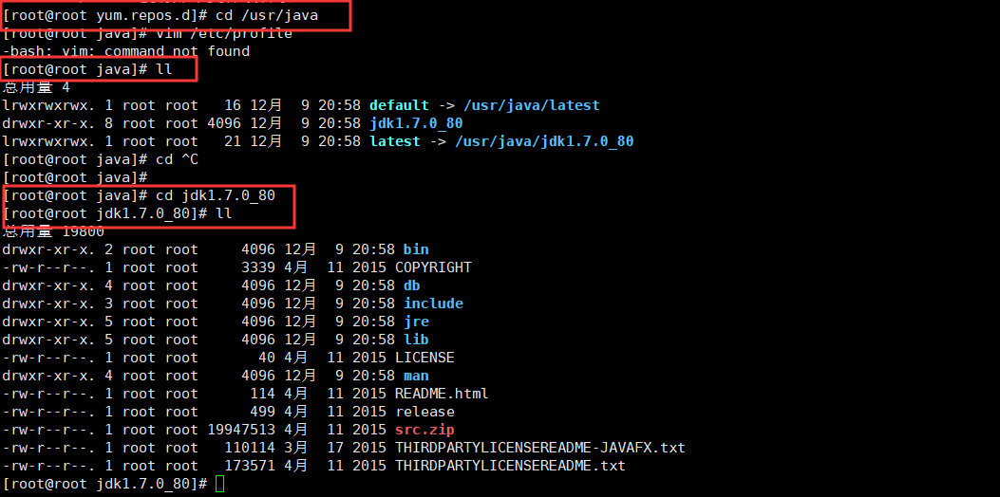
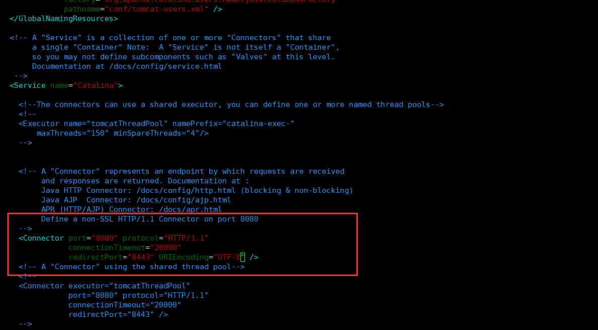
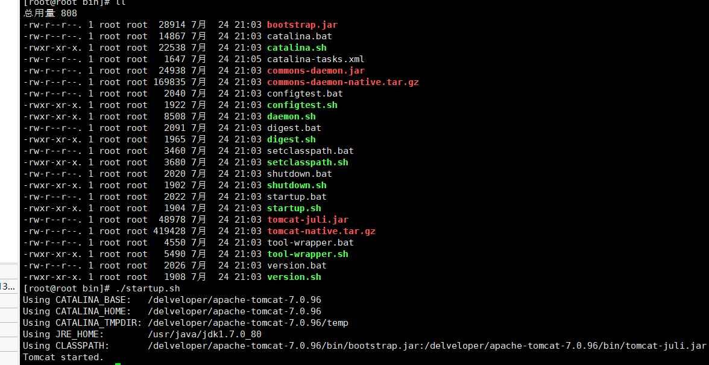
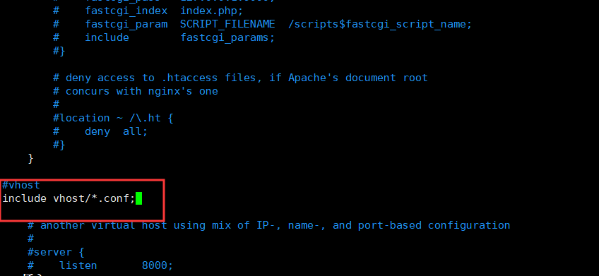
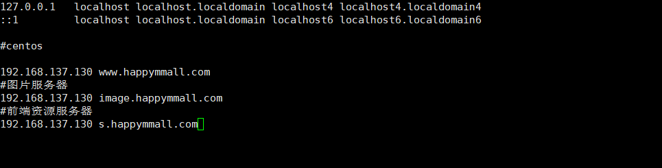
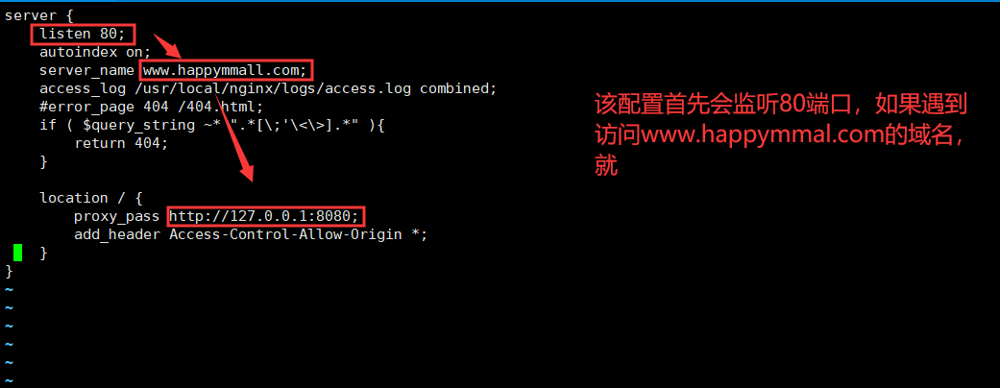
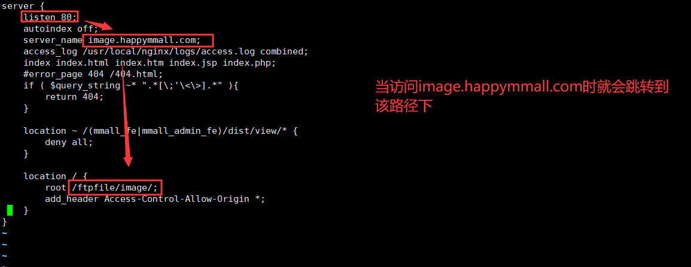
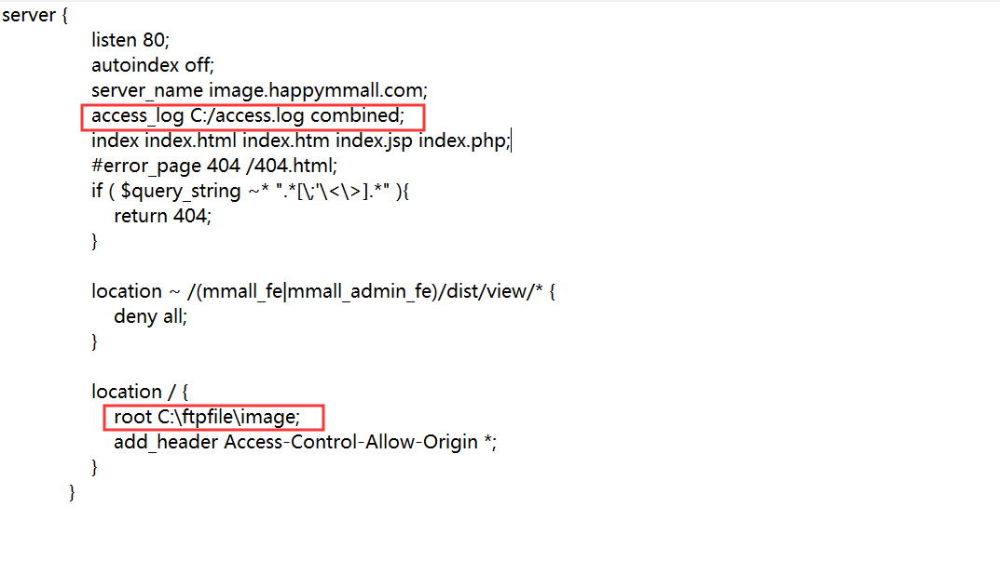
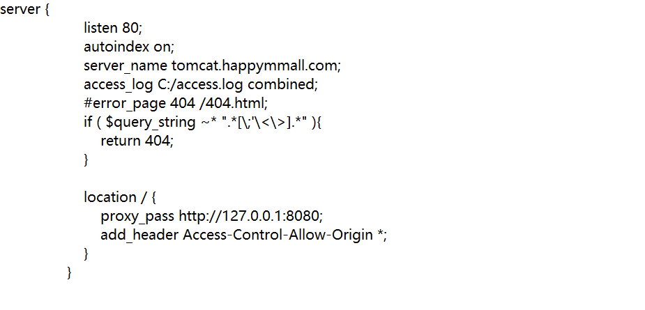

# 环境搭建

## linux环境搭建
    1. linux系统安装
        * 下载好CentOS6.8的Linux版本的镜像，在虚拟机上完成安装即可

    2. 执行相关命令完成配置(配置yum源到阿里云)
        <1>  备份(注意如果linux上没有wget指令需要先安装)
            
            * mv /etc/yum.repos.d/CentOS-Base.repo /etc/yum.repos.d/CentOS-Base.repo.backup

            * 执行yum -y install wget即可完成安装

        <2> 下载新的 CentOS-Base.repo 到 /etc/yum.repos.d/
            * wget -O /etc/yum.repos.d/CentOS-Base.repo http://mirrors.aliyun.com/repo/Centos-6.repo

        <3> 运行 yum makecache 生成缓存
    
## jdk环境搭建（Linux环境下安装jdk7u80 64位）
    1. 首先查看Linux上有哪些jdk，执行下列命令
        * rpm -qa | grep jdk

    2. 将已有的Open jdk删除
        * yum remove jdk文件名

    3. 下载jdkjdk7u80，到jdk官网找到相关的jdk（linux），复制链接使用weget完成下载
        * wget http://cdn-files.evildayz.com/mirror/java/jdk_7u80/jdk-7u80-linux-x64.rpm

    4. 完成下载后，执行下列命令完成解压安装
        * rpm -ivh jdk文件名（默认安装在/usr/java）

    5. 配置java环境变量
        1) 注意：完成配置需要进入jdk的目录下

        2) 执行vim /etc/profile

        3) 在文件中添加上如下配置
            export JAVA_HOME=/usr/java/jdk1.7.0_80
            export CLASSPATH=.:$JAVA_HOME/jre/lib/rt.jar:$JAVA_HOME/lib/dt.jar:$JAVA_HOME/lib/tools.jar
            export PATH=$JAVA_HOME/bin:$PATH

        4) 完成配置后，使配置生效
            * source /etc/profile

## Tomcat的环境安装(Linux环境下安装)
    1. 找到tomcat官网下载tomcat7.0版本
        * wget https://www-us.apache.org/dist/tomcat/tomcat-7/v7.0.96/bin/apache-tomcat-7.0.96.tar.gz

    2. 使用 tar -zxvf 文件名 完成解压(解压在/develeper/)

    3. 解压好后进入tomcat目录下，使用vim编辑conf目录下的server.xml文件
        * vim conf/server.xml

        1) 找到8080端口出的配置，在末尾加上URIEncoding="UTF-8"，也就是指定编码集，如下所示

    4. 配置环境变量
        1) 执行vim /etc/profile，在文件末尾加上下面指令
            * export CATALINA_HOME=/developer/apache-tomcat-7.0.96

        2) 执行下面命令使得环境变量生效
            * source /etc/profile

        3) 完成配置后，可以执行service iptables status查看防火墙是否开放8080端口，如果没有开放，可以执行
             * vim /etc/sysconfig/iptables 进入防火墙配置文件

             * -A INPUT  -p tcp --dport 8080 -j ACCEPT 开启8080端口

             * service iptables restart 重启防火墙

        4) 配置好之后，可以进入bin目录下启动startup.sh,进行访问查看是否成功

## Maven环境搭建
    1. 官网下载指定的安装包(apache-maven-3.0.5-bin.tar.gz)
        1) 下载后执行下列完成解压
            tar -zxvf apache-maven-3.0.5-bin.tar.gz

    2. 配置环境变量(配置path只需要将MAVEN_HOME加上即可)
        1) 执行vim /etc/profile

        2) 加入末尾下列两项配置
            * export MAVEN_HOME=/developer/apache-maven-3.0.5
            
            * export PATH=$JAVA_HOME/bin:$MAVEN_HOME/bin:$PATH

        3) 执行source /etc/profile,让其生效

    3. 执行mvn -version检验安装是否成功

## vsftpd(very secure FTP daemon)的搭建(Linux)
    1. 安装vsftpd
        1) 通过以下命令检验系统中是否已经安装该ftp服务器
            * rpm -qa | grep vsftpd

        2) 通过以下命令可以完成vsftpd的安装
            * yum -y install vsftpd

        3) 通过以下命令可以删除vsftpd
            * yum remove vsftpd

        4) 在根目录下(/)创建一个ftpfile文件夹，之后ftp的文件上传就会存放在该文件夹下
            * mkdir ftpfile

    2. 创建用于登录的用户信息
        1) 在ftpfile文件下创建一个用户，设置该用户没有登录linux的权限
            * useradd ftpuser -d /ftpfile -s /sbin/nologin

        2) 为该用户设置权限
            * chown -R ftpuser.ftpuser /ftpfile

        3) 为该用户设置密码
            * passwd ftpuser

        4) 使用vim /etc/vsftpd/vsftpd.conf进入配置文件
            * 如果不知道该文件在哪 可以使用whereis vsftpd查看

        5) 在配置文件中添加上下面内容，有的注释了，就直接打开注释即可
            anonymous_enable=NO
            local_enable=YES
            write_enable=YES
            local_umask=022
            dirmessage_enable=YES
            xferlog_enable=YES
            connect_from_port_20=YES
            xferlog_std_format=YES
            ftpd_banner=Welcome to happymmall FTP service.
            localroot=/ftpfile
            use_localtime=yes
            chroot_list_enable=YES
            chroot_list_file=/etc/vsftpd/chroot_list
            listen=YES
            pam_service_name=vsftpd
            userlist_enable=YES
            tcp_wrappers=YES
            pasv_min_port=61001
            pasv_max_port=62000

        6) 重启服务 service vsftpd restart

    3. 配置防火墙
        1) 打开防火墙的配置文件
            * vim /etc/sysconfig/iptables

        2) 在配置文件添加上下面配置
            -A INPUT  -p tcp --dport 61001:62000 -j ACCEPT
            -A OUTPUT  -p tcp --dport 61001:62000 -j ACCEPT
            -A INPUT  -p tcp --dport 20 -j ACCEPT
            -A OUTPUT  -p tcp --dport 20 -j ACCEPT
            -A INPUT  -p tcp --dport 21 -j ACCEPT
            -A OUTPUT  -p tcp --dport 21 -j ACCEPT

        3) 重启防火墙
            * service iptables restart

    4. 使用下列命令完成对selinux的修改
        1) 进入配置文件：vim /etc/selinux/config

        2) 将selinux的值修改为disabled

        3) 使用下列命令让修改生效
            * setenforce 0

    5. vsftpd的配置详解
        1）local_root=/ftpfile(当本地用户登入时，将被更换到定义的目录下，默认值为各用户的家目录)

        2）anon_root=/ftpfile(使用匿名登入时，所登入的目录)

        3）use_localtime=YES(默认是GMT时间，改成使用本机系统时间)

        4）anonymous_enable=NO(不允许匿名用户登录)

        5）local_enable=YES(允许本地用户登录)

        6）write_enable=YES(本地用户可以在自己家目录中进行读写操作)

        7）local_umask=022(本地用户新增档案时的umask值)

        8）dirmessage_enable=YES(如果启动这个选项，那么使用者第一次进入一个目录时，会检查该目录下是否有.message这
           个档案，如果有，则会出现此档案的内容，通常这个档案会放置欢迎话语，或是对该目录的说明。默认值为开启)
           
        9）xferlog_enable=YES(是否启用上传/下载日志记录。如果启用，则上传与下载的信息将被完整纪录在xferlog_file 
            所定义的档案中。预设为开启。)

        10）connect_from_port_20=YES(指定FTP使用20端口进行数据传输，默认值为YES)

        11）xferlog_std_format=YES(如果启用，则日志文件将会写成xferlog的标准格式)

        12）ftpd_banner=Welcome to mmall FTP Server(这里用来定义欢迎话语的字符串)

        13）chroot_local_user=NO(用于指定用户列表文件中的用户是否允许切换到上级目录)
        
        14）chroot_list_enable=YES(设置是否启用chroot_list_file配置项指定的用户列表文件)

        15）chroot_list_file=/etc/vsftpd/chroot_list(用于指定用户列表文件)

        16）listen=YES(设置vsftpd服务器是否以standalone模式运行，以standalone模式运行是一种较好的方式，此时listen
            必须设置为YES，此为默认值。建议不要更改，有很多与服务器运行相关的配置命令，需要在此模式下才有效，若设置为
            NO，则vsftpd不是以独立的服务运行，要受到xinetd服务的管控，功能上会受到限制)

        17）pam_service_name=vsftpd(虚拟用户使用PAM认证方式，这里是设置PAM使用的名称，默认即可，与/etc/pam.d/vsft
            pd对应) userlist_enable=YES(是否启用vsftpd.user_list文件，黑名单,白名单都可以

        18)pasv_min_port=61001(被动模式使用端口范围最小值)

        19)pasv_max_port=62000(被动模式使用端口范围最大值)
        
        20)pasv_enable=YES(pasv_enable=YES/NO（YES）
            若设置为YES，则使用PASV工作模式；若设置为NO，则使用PORT模式。默认值为YES，即使用PASV工作模式。
            FTP协议有两种工作方式：PORT方式和PASV方式，中文意思为主动式和被动式。

        一、PORT（主动）方式的连接过程是：客户端向服务器的FTP端口（默认是21）发送连接请求，服务器接受连接，建立一条
            命令链路。当需要传送数据时，客户端在命令链路上用 PORT命令告诉服务器：“我打开了****端口，你过来连接我”。
            于是服务器从20端口向客户端的****端口发送连接请求，建立一条数据链路来传送数据。

        二、PASV（被动）方式的连接过程是：客户端向服务器的FTP端口（默认是21）发送连接请求，服务器接受连接，建立一条
            命令链路。当需要传送数据时，服务器在命令链路上用 PASV命令告诉客户端：“我打开了****端口，你过来连接我”。
            于是客户端向服务器的****端口发送连接请求，建立一条数据链路来传送数据。

        从上面可以看出，两种方式的命令链路连接方法是一样的，而数据链路的建立方法就完全不同。而FTP的复杂性就在于此。

## Nginx环境搭建(Linux)
    1. Nginx的安装
        <1> 首先需要安装相关的依赖
            1) 安装gcc
                * yum -y install gcc-c++

            2) 安装prce
                * yum -y install pcre-devel

            3) 安装zlib
                * yum -y install zlib zlib-devel

            4) 安装openssl
                * yum -y install openssl openssl-devel

        <2> 安装Nginx
            1) 直接搜索Nginx，去到官网，找到1.10.2版本完成下载即可
                * wget http://nginx.org/download/nginx-1.10.3.tar.gz

            2) 完成解压
                tar -zxvf nginx-1.10.3.tar.gz

            3) 进入解压后的文件夹nginx-1.10.3   (cd nginx-1.10.3)

            4) 执行./configure

            5) 执行make

            6) 执行 make install 进行安装
                * 默认安装在/usr/local/nginx，可以使用whereis nginx查看

            7) 开启防火墙权限，使用下列命令进入防火墙配置
                * vim /etc/sysconfig/iptables

            8) 在防火墙配置中添加下列内容
                * -A INPUT -p tcp -m state --state NEW -m tcp --dport 80 -j ACCEPT
                    
            9) 重启防火墙，访问nginx
                * service iptables restart

    2. Nginx的相关命令
        <1> 启动Nginx(只需要运行sbin目录下的nginx)：
            * ./nginx

        <2> 验证Nginx能否正确运行在sbin目录下执行
            * nginx -t

        <3> 停止Nginx在sbin目录下执行
            * ./nginx -s stop

        <4> 重启,在sbin目录下执行
            * ./nginx -s reload

        <5> 查看Nginx进程(pid)
            * ps -ef | grep nginx 或者ps aux | grep nginx

        <6> 平滑重启
            * kill -HUP Ngnix主进程号(pid)
        
    3. 完成Nginx的配置（配置一个图片服务器）
        <1> 进入Nginx的安装目录的conf即/usr/local/nginx/conf，编辑配置文件
            * vim nginx.conf

        <2> 在配置文件中添加下列内容，入vhost文件夹中的所有以conf结尾的文件
            * include vhost/*.conf

    4. Nginx实现域名代理(linux)
        <1> 使用hosts模拟服务器域名，编辑hosts文件
            * vim /etc/hosts

        <2> 在conf目录下新建文件夹vhost，在vhost文件夹中创建配置文件
            1) 执行vim www.happymmall.com.conf

            2) 在www.happymmall.com.conf配置文件中添加下列内容(由域名转到一个http请求中)
                server {
                    listen 80;
                    autoindex on;
                    server_name www.happymmall.com;
                    access_log /usr/local/nginx/logs/access.log combined;
                    #error_page 404 /404.html;
                    if ( $query_string ~* ".*[\;'\<\>].*" ){
                        return 404;
                    }

                    location / {
                        proxy_pass http://127.0.0.1:8080;
                        add_header Access-Control-Allow-Origin *;
                    }
                }

 

            3) 完成配置后重启nginx
                * 在sbin目录下执行./nginx -s reload

            4) 注意：
                * 由于linux是本地搭建的，这里如果需要达到在windows中实现访问www.happymmall.com就跳转到tomcat页面，
                  那么需要将自己windows中的hosts(c:/windows/system32/drivers/etc/hosts)进行修改,配置hosts

    5. Nginx实现图片服务器代理
        <1> 由于已经创建了vhost，所以直接在该目录下创建image.happymmall.com.conf即可
            * vim image.happymmall.com.conf

        <2> 在image.happymmall.com.conf配置文件中添加下列配置
            server {
                listen 80;
                autoindex off;
                server_name image.happymmall.com;
                access_log /usr/local/nginx/logs/access.log combined;
                index index.html index.htm index.jsp index.php;
                #error_page 404 /404.html;
                if ( $query_string ~* ".*[\;'\<\>].*" ){
                    return 404;
                }

                location ~ /(mmall_fe|mmall_admin_fe)/dist/view/* {
                    deny all;
                }

                location / {
                    root /ftpfile/image/;
                    add_header Access-Control-Allow-Origin *;
                }
            }

 
            
    6. 在windows中实现nginx的配置
        <1> 打开c:/windows/system32/drivers/etc/hosts文件，设置ip的映射

        <2> 在nginx目录下的conf目录下配置nginx.conf(主配置文件)
            * include vhost/*.conf

        <3> 在conf文件夹下创建vhost文件夹，并建立相关域名的配置文件
            1) 文件夹路径转发的配置
            
           

            2) ip端口转发

  

## Mysql的环境搭建(Linux)
    1. Mysql的安装
        <1> 下列命令可以检查本机是否已经安装过mysql
            * rpm -qa | grep mysql

        <2> 下列命令可以安装mysql
            * yum -y install mysql-server

        <3> 使用下列命令进入配置文件中，加上下列内容可以解决中文乱码问题
            * 进入编辑配置文件：
                vim /etc/my.cnf

            * 解决中文乱码：
                default-character-set=utf8

        <4> 设置mysql随机启动
            1) 执行下列命令，检查设置是否为随机启动，如果第2到第5都是on或者启用，那么就说明是随机启动
                * chkconfig --list mysqld

            2) 下列命令设置为随机启动
                * chkconfig mysqld on

        <5> 配置防火墙开启3306端口
            1) 使用下列命令编辑防火墙配置
                * vim /etc/sysconfig/iptables

            2) 在配置中添加下列内容，开启3306端口
                * -A INPUT -m state --state NEW -m tcp -p tcp --dport 3306 -j ACCEPT

            3) 重启防火墙
                * service iptables restart

        <6> 使用下列命令开启mysql服务
            * service mysqld start

    2. Mysql的配置
        <1> 由于首次使用还没设置密码，所以可以使用下列命令直接登录
            * mysql -u root

        <2> 使用下列命令可以查看mysql的用户信息
            * select user, host, password from mysql.user;

        <3> 使用下列命令可以删除匿名用户(user项为空的即为匿名用户)
            * delete from mysql.user where user='';

        <4> 使用下列命令可以刷新权限
            * flush privileges;

        <5> mysql用户信息的相关操作
            1) 添加mysql用户和密码信息
                * insert into mysql.user(host,user,password)values('主机','用户名',password('密码'));

            2) 修改指定用户的密码
                * update mysql.user set password = password('root') where user = 'root';

                * set password for 用户名@主机名 = password('密码');

        <6> 添加一个项目需要使用的用户信息
            * insert into mysql.user(host,user,password)values('localhost','mmall',password('mmall'));

        <7> 创建新的数据库
            * create database 数据库名 default character set utf8 collate utf8_general_ci;

        <8> 为新添加的用户设置权限
            1) 为本地用户赋予所有权限
                * grant all privileges on 数据库.* to 用户名@localhost identified by '用户密码';

                * 如果localhost改为'%'就是代表所有ip用户

            2) 为所有ip(外网)用户设置部分权限
                * grant create,delete,select on 数据库.* to 用户名@'%' identified by '用户密码';
        
        <9> 执行flush privileges,刷新权限

## git的环境搭建
    1. git的安装
        <1> 使用下列命令完成下载
            * wget https://codeload.github.com/git/git/tar.gz/v2.24.1    

        <2> 解压
            * tar -zxvf 文件名

        <3> 安装相关的依赖
            * yum -y install zlib-devel openssl-devel cpio expat-devel gettext-devel curl-devel 
              
            * yum -y install perl-ExtUtils-CBuilder perl-ExtUtils- MakeMaker 
    
        <4> 进入解压后git的文件夹内，执行下列命令
            * make prefix=/usr/local all
    
            * 指定安装路径
                make prefix=/usr/local install

        <5> 配置环境变量
            1) vim /etc/profile

            2) 添加export GIT_HOME=/usr/local/git

            3) 在path中添加上$GIT_HOME/bin:

            4) source /etc/profile

        <6>  git常用命令
            1) 配置用户名: git config --global user.name "用户名"

            2) 配置邮箱: git config --global user.email "邮箱"

            3) Git忽略Windows/Unix换行符转换: git config --global core.autocrlf false

            4) 避免git status中文乱码: git config --global core.quotepath off

    2. 设置ssh
        <1> 设置密钥
            1) 生成密钥
                * ssh-keygen -t rsa -C "邮箱"

            2) 将密钥告知系统
                * ssh-add ~/.ssh/id_rsa

            3) 查看密钥(公钥)
                * cat ~/.ssh/id_rsa.pub

            4) 在github或者码云中设置公钥

        