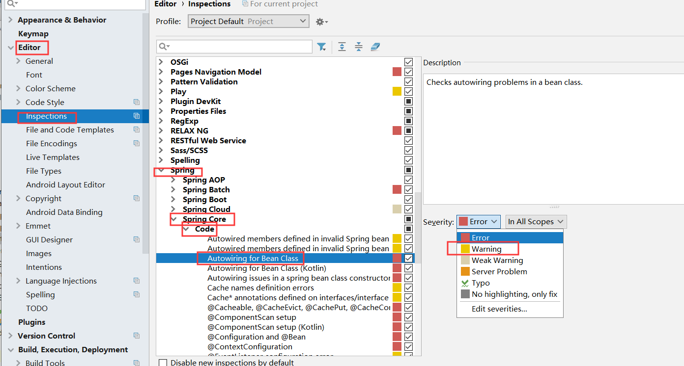

# 项目初始化(项目流程)

## 数据库初始化
    1. 创建项目需要用到的数据库文件(表)

## 配置tomcat与创建maven项目
    1. 在idea中创建我们需要做的项目(mmall)，并配置好tomcat以及maven

## git初始化(使用分支完成版本的控制)
    1. 使用git管理创建的项目

    2. 创建git.ingnore文件

    3. 将项目推送到远程master

    3. 创建分支
        <1> git checkout -b v1.0 origin/master:创建分支1.0，以mster为样本

        <2>  git push origin HEAD -u:将创建好的分支提交到远程的github

## 配置maven的pom.xml
    1. 参考pom.xml

## 在完成Mybatis三剑客的配置之后，配置spring以及springmvc的配置(整合)
    1. 配置web.xml

    2. 配置spring的配置文件applicationContext.xml

    3. 配置applicationContext.xml中分离的配置文件applicationContext-datasource.xml

    4. 配置数据数据源文件datasource.properties

## 配置日志打印logback

## 配置ftp配置文件
    1. 配置mmall.properties

## idea中自动编译配置以及注入
    1. 自动编译配置
        settings -> complier -> build project Automatically

    2. 在使用autowire注解时，注入到类中，使用mybatis默认idea会认为错误，需要如下配置解决

  

## 相关插件的安装
    1. web前端助手
        * 谷歌应用商店添加即可

    2. restlet client

